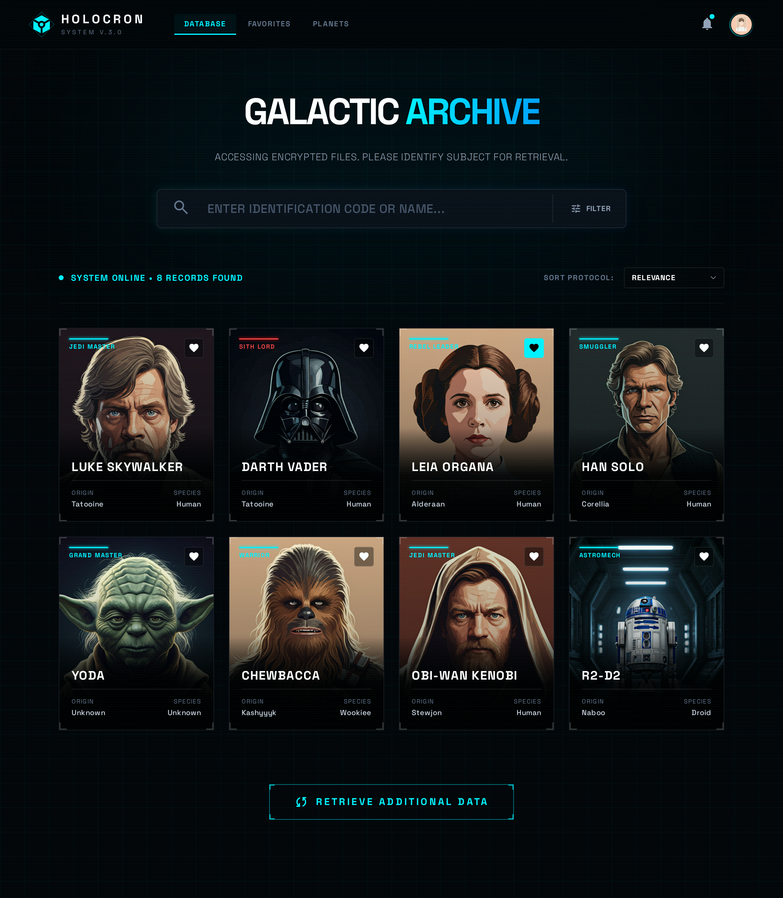
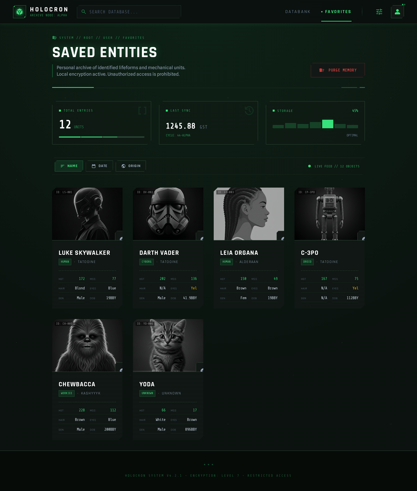

Este documento en español contiene el proceso de creación de la aplicación Holocron, junto a su razonamiento y toma de desiciones.

Primero se tomó la desición en base a los atributos de la API de Star Wars cuál iba a ser la idea del diseño de la aplicación. La idea conceptual, ayudado por IA, es la siguiente

Por supuesto que no se espera que este sea el resultado final, ni siquiera está coherente la paleta de colores, pero es el punto de partida.

También siguiendo las buenas prácticas de la web se decidió hacer un SPA (Single Page Application) para que la aplicación sea más rápida y eficiente, por lo que la aplicación no va a incluir un ruteo como tal.